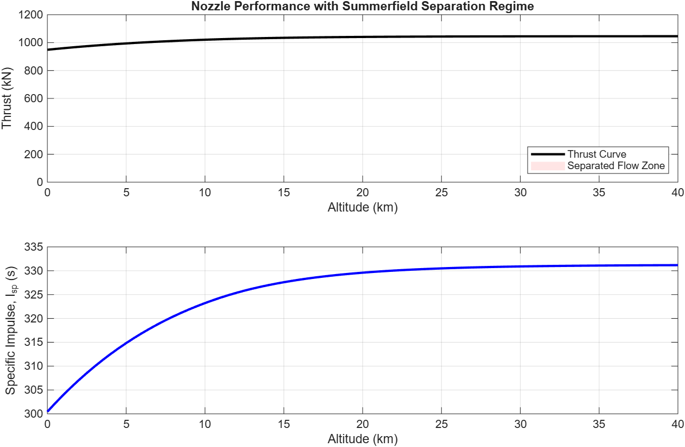

# 1D Rocket Nozzle Performance Simulator

## Overview
This MATLAB script simulates the 1D isentropic performance of a rocket nozzle across varying flight altitudes (0 to 40,000 meters). The script evaluates real-world environmental changes using the U.S. Standard Atmosphere model and incorporates advanced conditional logic to predict flow-separation risks.

## Engine Configuration: SpaceX Merlin 1D
To validate the model, the simulation utilizes operational specifications from the SpaceX Merlin 1D sea-level engine:
* Chamber Pressure ($P_c$): 97 bar
* Chamber Temperature ($T_c$): 3,573 K
* Expansion Ratio ($A_e/A_t$): 16
* Gas Profile: LOX/RP-1 ($\gamma = 1.20$, $MW = 21.6$ g/mol)

## Core MATLAB Concepts Demonstrated
* **Numerical Solvers:** Implemented `fzero` with anonymous function handles to solve implicit compressible flow area-ratio equations.
* **Aerospace Libraries:** Utilized `atmosisa` to dynamically import true ambient atmospheric pressure vectors.
* **Control Flow Automation:** Engineered a `for` loop embedded with an `if/else` decision tree evaluating **Summerfield's Criterion** ($P_e \le 0.35 \times P_a$) to flag flow separation risks.

## Key Insights
Running the Merlin 1D configuration outputs a steady choke mass flow rate of **321.85 kg/s** and an exit speed of **Mach 3.60**. The script confirms a separation altitude of **0 meters**, validating that the engine's high chamber pressure successfully maintains fully attached flow even at maximum sea-level atmospheric density.
## Simulation Visualization

